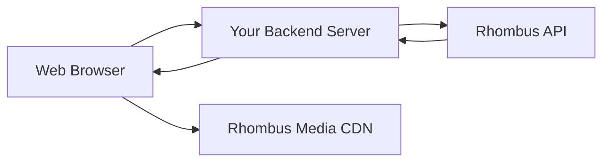

<Info>
**Full Example Available**

The complete working implementation is available on GitHub: [RhombusSystems/player-example](https://github.com/RhombusSystems/player-example)
</Info>

## Overview

The Rhombus video player integration enables you to:

<CardGroup cols={2}>
  <Card title="Stream Live Video" icon="video">
    Display real-time camera feeds with adaptive bitrate streaming
  </Card>

  <Card title="Secure Authentication" icon="shield-check">
    Use federated session tokens for time-limited, secure access
  </Card>

  <Card title="Optimized Playback" icon="gauge-high">
    Pre-configured settings optimized for security camera footage
  </Card>

  <Card title="Easy Integration" icon="code">
    Drop-in solution with minimal configuration required
  </Card>
</CardGroup>

## Architecture

The video player implementation follows a three-tier architecture:



<Steps>
  <Step title="Frontend Requests Token">
    Your web application requests authentication from your backend server
  </Step>

  <Step title="Backend Proxies to Rhombus">
    Your server authenticates with Rhombus API using your API key and returns a federated token
  </Step>

  <Step title="Frontend Gets Media URI">
    Using the token, your frontend requests the camera's streaming URI
  </Step>

  <Step title="Direct Stream Playback">
    DashJS player connects directly to Rhombus CDN using the authenticated URI
  </Step>
</Steps>

## Prerequisites

Before implementing the video player, ensure you have:

<AccordionGroup>
  <Accordion title="Rhombus API Credentials" icon="key">
    Generate an API key from your [Rhombus Console](https://console.rhombussystems.com/settings/api-management/). This key will be used by your backend server to authenticate with the Rhombus API.

    <Warning>
    Never expose your API key in frontend code. Always use a backend proxy server.
    </Warning>
  </Accordion>

  <Accordion title="Camera UUID" icon="camera">
    Obtain your camera's UUID from the Rhombus Console or via the API:

    ```bash
    curl -X POST "https://api2.rhombussystems.com/api/camera/getCamerasWithFeatures" \
      -H "x-auth-apikey: YOUR_API_KEY" \
      -H "x-auth-scheme: api-token"
    ```
  </Accordion>

  <Accordion title="Backend Server" icon="server">
    Set up a proxy server to handle API authentication. Your server must implement two endpoints:
    - Token generation endpoint (forwards to `/org/generateFederatedSessionToken`)
    - Media URI endpoint (forwards to `/camera/getMediaUris`)
  </Accordion>
</AccordionGroup>

## Implementation Guide

### Step 1: Set Up Your HTML Page

Create a basic HTML structure with the DashJS player:

```html index.html
<!DOCTYPE html>
<html lang="en">
<head>
    <meta charset="UTF-8">
    <meta name="viewport" content="width=device-width, initial-scale=1.0">
    <title>Rhombus Camera Stream</title>
    <script src="https://cdn.dashjs.org/latest/dash.all.min.js"></script>
    <style>
        body {
            margin: 0;
            padding: 20px;
            font-family: Arial, sans-serif;
            background-color: #1a1a1a;
        }
        #video-container {
            max-width: 1280px;
            margin: 0 auto;
        }
        video {
            width: 100%;
            background-color: #000;
            border-radius: 8px;
        }
        .controls {
            margin-top: 20px;
            text-align: center;
        }
        button {
            padding: 10px 20px;
            margin: 0 5px;
            background-color: #2563EB;
            color: white;
            border: none;
            border-radius: 4px;
            cursor: pointer;
            font-size: 14px;
        }
        button:hover {
            background-color: #1D4ED8;
        }
    </style>
</head>
<body>
    <div id="video-container">
        <video id="videoPlayer" controls></video>
        <div class="controls">
            <button onclick="play()">Play</button>
            <button onclick="pause()">Pause</button>
        </div>
    </div>

    <script src="player.js"></script>
</body>
</html>
```

### Step 2: Configure Player Settings

Create your player configuration file:

```javascript player.js
// Configuration - Replace with your values
const CAMERA_UUID = "YOUR_CAMERA_UUID_HERE";
const BASE_URL = "https://your-server.com/api";
const GET_FEDERATED_TOKEN_PATH = "/getFederatedToken";
const GET_MEDIA_URIS_PATH = "/getMediaUris";

// Global variables
let player;
let federatedToken;

// Initialize player on page load
document.addEventListener('DOMContentLoaded', async () => {
    await initializePlayer();
});
```

### Step 3: Implement Authentication

Add token management functionality:

```javascript Token Management
async function getFederatedSessionToken() {
    try {
        const response = await fetch(`${BASE_URL}${GET_FEDERATED_TOKEN_PATH}`, {
            method: 'POST',
            headers: {
                'Content-Type': 'application/json',
            },
            body: JSON.stringify({
                durationSec: 86400  // 24 hours
            })
        });

        if (!response.ok) {
            throw new Error(`Token request failed: ${response.status}`);
        }

        const data = await response.json();
        federatedToken = data.federatedSessionToken;

        console.log('Federated token obtained successfully');
        return federatedToken;
    } catch (error) {
        console.error('Error getting federated token:', error);
        throw error;
    }
}

function modifyRequestURL(evt) {
    // Append authentication parameters to all stream requests
    if (!federatedToken) {
        console.error('No federated token available');
        return;
    }

    const url = new URL(evt.url);
    url.searchParams.set('x-auth-scheme', 'federated-token');
    url.searchParams.set('x-auth-ft', federatedToken);

    evt.url = url.toString();
}
```

### Step 4: Get Media Stream URI

Implement media URI retrieval:

```javascript Media URI Request
async function getMediaUri() {
    try {
        const response = await fetch(`${BASE_URL}${GET_MEDIA_URIS_PATH}`, {
            method: 'POST',
            headers: {
                'Content-Type': 'application/json',
            },
            body: JSON.stringify({
                cameraUuid: CAMERA_UUID
            })
        });

        if (!response.ok) {
            throw new Error(`Media URI request failed: ${response.status}`);
        }

        const data = await response.json();
        return data.wanLiveMpd;  // DASH manifest URL
    } catch (error) {
        console.error('Error getting media URI:', error);
        throw error;
    }
}
```

### Step 5: Initialize DashJS Player

Set up the video player with optimized settings:

```javascript Player Initialization
async function initializePlayer() {
    try {
        // Get authentication token
        await getFederatedSessionToken();

        // Get media stream URL
        const mediaUrl = await getMediaUri();

        // Initialize DashJS player
        const video = document.querySelector("#videoPlayer");
        player = dashjs.MediaPlayer().create();

        // Configure player settings optimized for security cameras
        player.updateSettings({
            streaming: {
                liveCatchup: {
                    enabled: true,
                    mode: 'liveCatchupModeDefault',
                    maxDrift: 10,
                    playbackRate: {
                        min: -0.5,
                        max: 0.5
                    }
                },
                buffer: {
                    fastSwitchEnabled: false,
                    stableBufferTime: 12,
                    bufferTimeAtTopQuality: 30,
                    bufferTimeAtTopQualityLongForm: 60
                },
                gaps: {
                    jumpGaps: true,
                    jumpLargeGaps: true,
                    smallGapLimit: 1.5
                },
                stallThreshold: 0.5
            },
            streaming: {
                scheduleWhilePaused: false
            }
        });

        // Set up URL modifier for authentication
        player.on(dashjs.MediaPlayer.events.FRAGMENT_LOADING_STARTED,
            modifyRequestURL);

        // Initialize and play
        player.initialize(video, mediaUrl, true);

        console.log('Player initialized successfully');
    } catch (error) {
        console.error('Error initializing player:', error);
        alert('Failed to initialize video player. Check console for details.');
    }
}
```

### Step 6: Add Playback Controls

Implement play/pause functionality:

```javascript Playback Controls
function play() {
    if (player) {
        player.play();
    }
}

function pause() {
    if (player) {
        player.pause();
    }
}

// Optional: Handle player events
function setupPlayerEvents() {
    player.on(dashjs.MediaPlayer.events.PLAYBACK_STARTED, () => {
        console.log('Playback started');
    });

    player.on(dashjs.MediaPlayer.events.PLAYBACK_PAUSED, () => {
        console.log('Playback paused');
    });

    player.on(dashjs.MediaPlayer.events.ERROR, (e) => {
        console.error('Player error:', e);
    });
}
```

## Backend Server Implementation

Your backend server must proxy requests to the Rhombus API. Here's an example using Node.js/Express:

<Tabs>
  <Tab title="Node.js/Express">
    ```javascript server.js
    const express = require('express');
    const axios = require('axios');
    const app = express();

    app.use(express.json());

    const RHOMBUS_API_KEY = process.env.RHOMBUS_API_KEY;
    const RHOMBUS_BASE_URL = 'https://api2.rhombussystems.com/api';

    // Federated token endpoint
    app.post('/api/getFederatedToken', async (req, res) => {
        try {
            const response = await axios.post(
                `${RHOMBUS_BASE_URL}/org/generateFederatedSessionToken`,
                { durationSec: req.body.durationSec || 86400 },
                {
                    headers: {
                        'x-auth-apikey': RHOMBUS_API_KEY,
                        'x-auth-scheme': 'api-token',
                        'Content-Type': 'application/json'
                    }
                }
            );
            res.json(response.data);
        } catch (error) {
            console.error('Error generating token:', error);
            res.status(500).json({ error: 'Failed to generate token' });
        }
    });

    // Media URI endpoint
    app.post('/api/getMediaUris', async (req, res) => {
        try {
            const response = await axios.post(
                `${RHOMBUS_BASE_URL}/camera/getMediaUris`,
                { cameraUuid: req.body.cameraUuid },
                {
                    headers: {
                        'x-auth-apikey': RHOMBUS_API_KEY,
                        'x-auth-scheme': 'api-token',
                        'Content-Type': 'application/json'
                    }
                }
            );
            res.json(response.data);
        } catch (error) {
            console.error('Error getting media URIs:', error);
            res.status(500).json({ error: 'Failed to get media URIs' });
        }
    });

    app.listen(3000, () => {
        console.log('Server running on port 3000');
    });
    ```
  </Tab>

  <Tab title="Python/Flask">
    ```python app.py
    from flask import Flask, request, jsonify
    import requests
    import os

    app = Flask(__name__)

    RHOMBUS_API_KEY = os.environ.get('RHOMBUS_API_KEY')
    RHOMBUS_BASE_URL = 'https://api2.rhombussystems.com/api'

    @app.route('/api/getFederatedToken', methods=['POST'])
    def get_federated_token():
        try:
            data = request.get_json()
            duration = data.get('durationSec', 86400)

            response = requests.post(
                f'{RHOMBUS_BASE_URL}/org/generateFederatedSessionToken',
                json={'durationSec': duration},
                headers={
                    'x-auth-apikey': RHOMBUS_API_KEY,
                    'x-auth-scheme': 'api-token',
                    'Content-Type': 'application/json'
                }
            )
            response.raise_for_status()
            return jsonify(response.json())
        except Exception as e:
            return jsonify({'error': str(e)}), 500

    @app.route('/api/getMediaUris', methods=['POST'])
    def get_media_uris():
        try:
            data = request.get_json()
            camera_uuid = data.get('cameraUuid')

            response = requests.post(
                f'{RHOMBUS_BASE_URL}/camera/getMediaUris',
                json={'cameraUuid': camera_uuid},
                headers={
                    'x-auth-apikey': RHOMBUS_API_KEY,
                    'x-auth-scheme': 'api-token',
                    'Content-Type': 'application/json'
                }
            )
            response.raise_for_status()
            return jsonify(response.json())
        except Exception as e:
            return jsonify({'error': str(e)}), 500

    if __name__ == '__main__':
        app.run(port=3000)
    ```
  </Tab>
</Tabs>

## Player Configuration Options

The DashJS player can be customized with various settings optimized for different use cases:

<ParamField path="liveCatchup.enabled" type="boolean" default="true">
  Enable automatic catch-up to live edge when playback falls behind
</ParamField>

<ParamField path="liveCatchup.maxDrift" type="number" default="10">
  Maximum allowed drift from live edge in seconds before catch-up kicks in
</ParamField>

<ParamField path="buffer.stableBufferTime" type="number" default="12">
  Target buffer size for stable playback in seconds
</ParamField>

<ParamField path="buffer.fastSwitchEnabled" type="boolean" default="false">
  Disable fast quality switching to maintain consistent video quality
</ParamField>

<ParamField path="gaps.jumpGaps" type="boolean" default="true">
  Automatically skip small gaps in the stream
</ParamField>

<ParamField path="stallThreshold" type="number" default="0.5">
  Time in seconds before considering playback stalled
</ParamField>

## Security Best Practices

<Warning>
**Critical Security Requirements**

Follow these security practices to protect your API credentials and ensure secure streaming:
</Warning>

<AccordionGroup>
  <Accordion title="Never Expose API Keys" icon="triangle-exclamation">
    - Store API keys only on your backend server
    - Use environment variables for sensitive credentials
    - Never commit API keys to version control
    - Rotate keys regularly
  </Accordion>

  <Accordion title="Implement Access Controls" icon="lock">
    - Authenticate users before granting stream access
    - Implement rate limiting on your proxy endpoints
    - Log all access requests for audit trails
    - Use short-lived federated tokens (24 hours or less)
  </Accordion>

  <Accordion title="Validate All Requests" icon="shield">
    - Sanitize camera UUID inputs
    - Validate token expiration
    - Check user permissions before proxying requests
    - Implement CSRF protection
  </Accordion>

  <Accordion title="Use HTTPS Everywhere" icon="globe">
    - Enforce HTTPS for all communications
    - Implement proper SSL/TLS certificates
    - Enable HSTS headers
    - Validate certificate chains
  </Accordion>
</AccordionGroup>

## Troubleshooting

<AccordionGroup>
  <Accordion title="Video Not Loading" icon="circle-xmark">
    **Check these common issues:**

    1. Verify your backend server is running and accessible
    2. Confirm camera UUID is correct (check Rhombus Console)
    3. Check browser console for error messages
    4. Verify API key has proper permissions
    5. Ensure CORS is properly configured on your server

    **Test your endpoints:**
    ```bash
    # Test token generation
    curl -X POST "https://your-server.com/api/getFederatedToken" \
      -H "Content-Type: application/json" \
      -d '{"durationSec": 86400}'

    # Test media URI retrieval
    curl -X POST "https://your-server.com/api/getMediaUris" \
      -H "Content-Type: application/json" \
      -d '{"cameraUuid": "YOUR_CAMERA_UUID"}'
    ```
  </Accordion>

  <Accordion title="Playback Issues" icon="circle-pause">
    **Buffering or stuttering:**

    - Reduce `bufferTimeAtTopQuality` for faster startup
    - Increase `stableBufferTime` for smoother playback
    - Check network bandwidth and latency
    - Verify CDN connectivity

    **Stream disconnects:**

    - Check token expiration (default 24 hours)
    - Verify continuous network connectivity
    - Review firewall rules for CDN access
    - Check browser console for errors
  </Accordion>

  <Accordion title="Authentication Errors" icon="key">
    **Token generation fails:**

    - Verify API key is valid and not expired
    - Check API key permissions in Rhombus Console
    - Ensure headers are correctly formatted
    - Verify account is active

    **Token rejected during playback:**

    - Check token expiration time
    - Verify URL parameters are properly appended
    - Ensure token is correctly passed to all requests
    - Check for special characters in token
  </Accordion>
</AccordionGroup>

## Advanced Features

### Multi-Camera Grid

Display multiple camera feeds simultaneously:

```javascript Multi-Camera Setup
class MultiCameraPlayer {
    constructor() {
        this.players = new Map();
    }

    async addCamera(cameraUuid, containerId) {
        const token = await getFederatedSessionToken();
        const mediaUrl = await getMediaUri(cameraUuid);

        const video = document.querySelector(`#${containerId}`);
        const player = dashjs.MediaPlayer().create();

        player.updateSettings({
            streaming: {
                liveCatchup: { enabled: true, maxDrift: 10 },
                buffer: { stableBufferTime: 8 }
            }
        });

        player.on(dashjs.MediaPlayer.events.FRAGMENT_LOADING_STARTED,
            (evt) => this.modifyRequestURL(evt, token));

        player.initialize(video, mediaUrl, true);
        this.players.set(cameraUuid, player);
    }

    modifyRequestURL(evt, token) {
        const url = new URL(evt.url);
        url.searchParams.set('x-auth-scheme', 'federated-token');
        url.searchParams.set('x-auth-ft', token);
        evt.url = url.toString();
    }
}

// Usage
const multiPlayer = new MultiCameraPlayer();
await multiPlayer.addCamera('camera-uuid-1', 'video1');
await multiPlayer.addCamera('camera-uuid-2', 'video2');
```

### Custom Controls

Build custom video controls:

```javascript Custom Controls
class VideoControls {
    constructor(player) {
        this.player = player;
        this.setupEventListeners();
    }

    setupEventListeners() {
        // Volume control
        document.querySelector('#volume-slider').addEventListener('input', (e) => {
            this.player.setVolume(e.target.value / 100);
        });

        // Quality selection
        document.querySelector('#quality-select').addEventListener('change', (e) => {
            const quality = parseInt(e.target.value);
            this.player.setQualityFor('video', quality);
        });

        // Fullscreen toggle
        document.querySelector('#fullscreen-btn').addEventListener('click', () => {
            const video = document.querySelector('#videoPlayer');
            if (video.requestFullscreen) {
                video.requestFullscreen();
            }
        });
    }

    updateQualityOptions() {
        const bitrates = this.player.getBitrateInfoListFor('video');
        const select = document.querySelector('#quality-select');

        bitrates.forEach((bitrate, index) => {
            const option = document.createElement('option');
            option.value = index;
            option.text = `${bitrate.height}p (${Math.round(bitrate.bitrate / 1000)}kbps)`;
            select.appendChild(option);
        });
    }
}
```

## Next Steps

<CardGroup cols={2}>
  <Card
    title="API Reference"
    icon="book"
    href="/api-reference/endpoint/access-control/accesscontrol-adduserstoaccesscontrolgroup"
  >
    Explore all camera and streaming endpoints
  </Card>

  <Card
    title="GitHub Example"
    icon="github"
    href="https://github.com/RhombusSystems/player-example"
  >
    Clone the complete working example
  </Card>

  <Card
    title="DashJS Documentation"
    icon="file-code"
    href="https://github.com/Dash-Industry-Forum/dash.js/wiki"
  >
    Learn more about DashJS configuration
  </Card>

  <Card
    title="Get Support"
    icon="life-ring"
    href="https://rhombus.community"
  >
    Join the developer community for help
  </Card>
</CardGroup>

## Support

Need help with your implementation?

- Email: [api@rhombus.com](mailto:api@rhombus.com)
- Community: [rhombus.community](https://rhombus.community)
- GitHub: [Report an issue](https://github.com/RhombusSystems/player-example/issues)

<Note>
This implementation guide is based on the official [Rhombus player example](https://github.com/RhombusSystems/player-example) and is regularly updated to reflect best practices.
</Note>
